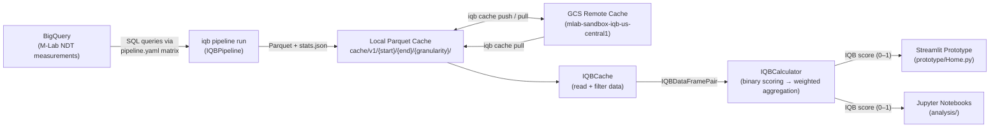

# IQB Architecture

## Overview

The Internet Quality Barometer (IQB) is a framework for computing a composite
score that reflects the quality of an Internet connection across a set of
real-world use cases. The system is structured as a monorepo containing four
distinct components: a scoring library, a Streamlit-based dashboard prototype,
Jupyter notebooks for exploratory analysis, and a data workspace managing the
pipeline that acquires and caches measurement data.

The design enforces a clear separation between:

- **Data acquisition** — querying BigQuery for M-Lab NDT measurements
- **Scoring logic** — computing IQB scores from aggregated measurement data
- **Visualization** — presenting scores and trends in an interactive dashboard

This separation allows each layer to evolve independently. Researchers can work
with the library API and notebooks without touching the dashboard; dashboard
developers can consume pre-computed cached data without running the pipeline.

---

## Repository Structure

```
iqb/
├── library/          # mlab-iqb Python package (scoring logic, cache API, pipeline)
│   └── src/iqb/
│       ├── calculator.py    # IQBCalculator: weighted use-case scoring
│       ├── config.py        # IQB_CONFIG: default thresholds and weights
│       ├── cache/           # IQBCache: read Parquet data from local cache
│       ├── pipeline/        # IQBPipeline: query BigQuery, write Parquet
│       ├── ghremote/        # IQBRemoteCache: sync with GCS remote cache
│       ├── queries/         # SQL query templates
│       └── cli/             # iqb command-line interface
├── prototype/        # Streamlit dashboard (Phase 1 prototype)
│   ├── Home.py              # Application entry point
│   ├── pages/               # Additional Streamlit pages (e.g., IQB_Map.py)
│   ├── utils/               # Calculation helpers, constants, data loaders
│   ├── visualizations/      # Chart components (sunburst, maps)
│   ├── cache/               # Static JSON cache files per country/ASN
│   └── Dockerfile           # Container image for Cloud Run deployment
├── analysis/         # Jupyter notebooks for research and experimentation
│   ├── 00-template.ipynb    # Worked example using IQBCache + IQBCalculator
│   └── .iqb/                # Symlink to data workspace inside analysis env
├── data/             # Pipeline configuration and local Parquet cache
│   ├── pipeline.yaml        # Query matrix (date ranges × granularities)
│   ├── cache/               # Parquet files written by iqb pipeline run
│   └── state/               # Remote cache manifest (ghremote)
└── docs/             # Documentation, design docs, internals guides
```

---

## Data Flow Pipeline



### Pipeline Stages

1. **Query** — `IQBPipeline` reads `pipeline.yaml` to determine the date
   ranges and granularities (country, country_asn, subdivision1,
   subdivision1_asn, city, city_asn) to query. It runs parameterised SQL
   against BigQuery and writes `data.parquet` and `stats.json` per entry.

2. **Cache** — Results are stored as Parquet files under
   `cache/v1/{start_date}/{end_date}/{query_type}/`. The format supports
   streaming reads and chunked row groups for memory efficiency.

3. **Remote sync** — `IQBRemoteCache` (and its GitHub-backed variant
   `IQBGitHubRemoteCache`) can push local results to GCS and pull
   pre-computed files to avoid re-running expensive BigQuery queries.

4. **Scoring** — `IQBCache` reads and filters Parquet data into an
   `IQBDataFramePair`. The caller extracts a percentile (e.g., the 50th),
   converts it to a flat measurement dict, and passes it to
   `IQBCalculator.calculate_iqb_score()`.

5. **Presentation** — The Streamlit prototype loads pre-computed JSON files
   from `prototype/cache/` and calls the library to compute scores
   interactively.

---

## Scoring Logic and Visualization Separation

The scoring logic is entirely contained in `library/src/iqb/`:

- `IQB_CONFIG` in `config.py` encodes use cases, network requirements,
  per-requirement weights, binary thresholds, and dataset weights.
- `IQBCalculator.calculate_iqb_score()` applies a two-level weighted
  aggregation: first across datasets for each requirement (requirement
  agreement score), then across requirements for each use case (use case
  score), and finally across use cases (IQB score).
- The result is a single float in [0, 1].

The dashboard in `prototype/` depends on the library as a workspace member
(`mlab-iqb`) but contains no scoring logic itself. All calculation helpers
in `prototype/utils/calculation_utils.py` delegate to `IQBCalculator` and
manipulate `IQB_CONFIG` purely for session-specific overrides (custom
thresholds, user-adjusted weights).

This boundary ensures that changes to the scoring methodology require updates
only in the library and are automatically reflected in both the prototype and
analysis notebooks without any additional code changes.

---

## Extensibility

**Adding a new use case** — Extend `IQB_CONFIG` in `config.py` with a new
key under `"use cases"`, defining its weight, network requirements, thresholds,
and dataset weights. `IQBCalculator` picks up the new use case automatically
without code changes.

**Adding a new dataset** — Add the dataset name to the `"datasets"` sub-dict
for each network requirement that the dataset covers. Set the weight (`"w"`)
to 0 to include the dataset structurally while keeping it inactive; set it to
a positive value to activate it. Ensure data for the dataset is available in
`IQBCache` or supplied in the `data` dict passed to `calculate_iqb_score()`.

**Adding a new metric (network requirement)** — Add the requirement key to
each use case in `IQB_CONFIG` and implement the corresponding binary scoring
branch in `IQBCalculator.calculate_binary_requirement_score()`.

**Adding a new dashboard page** — Create a new `.py` file in
`prototype/pages/`. Streamlit automatically discovers and adds it to the
sidebar. Consume library APIs and `prototype/utils/` helpers rather than
reimplementing scoring logic.

---

## Scalability Considerations

- **Granularity matrix** — The `pipeline.yaml` matrix defines the full
  Cartesian product of date ranges and granularities. Adding new time
  periods or geographic granularities requires only a YAML change; no
  code changes are needed.
- **Parquet format** — Parquet supports columnar reads and predicate pushdown.
  Filtering by `country_code` or `asn` before loading data avoids reading
  full datasets into memory.
- **GCS remote cache** — Pre-computed results can be shared across teams via
  GCS without requiring anyone to run BigQuery queries. The manifest tracks
  available entries, allowing incremental pulls.

---

## Performance Considerations

- **Caching at the pipeline level** — `IQBPipeline` checks for existing
  Parquet files before executing BigQuery queries to avoid redundant cloud
  spend. `stats.json` records bytes billed and duration for auditability.
- **Static JSON cache in prototype** — The dashboard reads pre-computed
  JSON files from `prototype/cache/` rather than querying BigQuery at
  runtime. This eliminates network latency and authentication requirements
  for end users.
- **Percentile aggregation** — Raw measurement data is pre-aggregated to
  percentile summaries (e.g., p50, p90) before being stored. This reduces
  data volume and allows the dashboard to operate without streaming large
  raw datasets.
- **Streamlit session state** — `session_state.py` caches computation
  results within a user session to avoid recalculating scores on every
  widget interaction.
